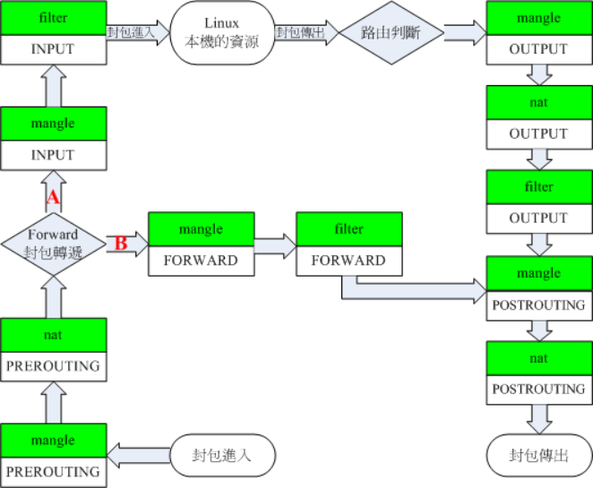

# tproxy-transparent-proxy

## Linux netfilter modules



> 表（table）是功能分类  
> 链（chain）是数据包流经的“关卡”  
> 表包含链，同一条链可以存在于多个表中

表 (table):

| 表       | 作用                             |
| -------- | -------------------------------- |
| filter   | 负责过滤（放行/丢弃）            |
| nat      | 地址转换（DNAT/SNAT/MASQUERADE） |
| mangle   | 修改数据包（TTL/标记/优先级等）  |
| raw      | 连接跟踪控制                     |
| security | SELinux 相关                     |

链 (chain):

| 链          | 什么时候经过     |
| ----------- | ---------------- |
| PREROUTING  | 数据包刚进入网卡 |
| INPUT       | 目的地是本机     |
| FORWARD     | 转发到别的机器   |
| OUTPUT      | 本机发出的包     |
| POSTROUTING | 即将发出网卡     |

## ip route set

```shell
# remove ruleset
nft flush ruleset
nft list ruleset
nft list tables


# check route
ip route show

# add route table
ip route add local 0.0.0.0/0 dev lo table 100
ip -6 route add local ::/0 dev lo table 106

# add route policy
ip rule add fwmark 1 table 100
ip -6 rule add fwmark 1 table 106

# remove

ip rule del fwmark 1 table 100
ip -6 rule del fwmark 1 table 106

ip route del local 0.0.0.0/0 dev lo table 100
ip -6 route del local ::/0 dev lo table 106


```

## Configuration

tproxy port: 12380
